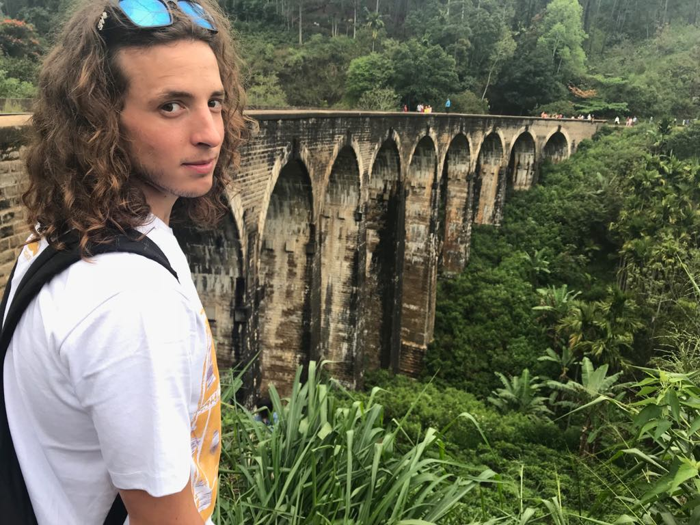
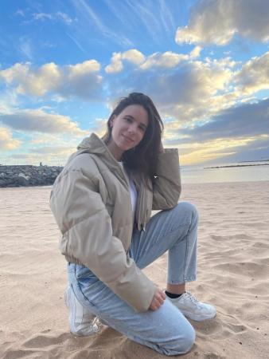
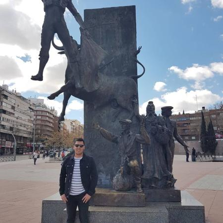

# YourSecondChoso


  **Your Second Choso** it's a SPA that provide you information about Canary Islands Culture. In these app you can find:
- location of "Guachinches"(local restaurant)
- events of different islands
- beachs
- shops with tradicional food.

You can see all of this in the following [page](https://landingysc.netlify.app/).

If you wanna colaborate in this project, fork the repository and follow these steps.

##  Project setup
Install all the project's dependencies
```

npm install

```
###  Compiles and hot-reloads for development
Run the project locally in order to start with the development
```

npm run serve

``` 
###  Lints and fixes files
Run the lint's rules(optional)
```

npm run lint

```
# Team Choso


- **Bruno Aggierni:** Adventurer, explorer, polyglot and coffee lover. Passionate about traveling and getting lost. Favorite fruit: Papaya. Favorite sport: Soccer. Worst wine in the world? - My mother-in-law's wine.



- **Carmen Castro:** Born in Tacoronte, I am passionate about traveling, meeting people from all corners of the world and never stop learning. Where there is a beach and sun all the rest is gone.



- **Juan Pablo Claros:** Better known as Juampi the palmero. Passionate about video games and everything related to application development and self-learning. I like to play sports, especially soccer and eat arepitas de la arepera 23 (100% recommended).
